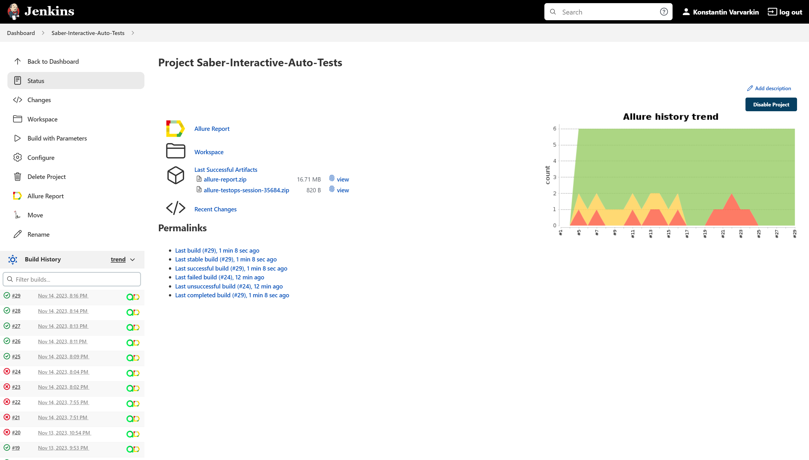
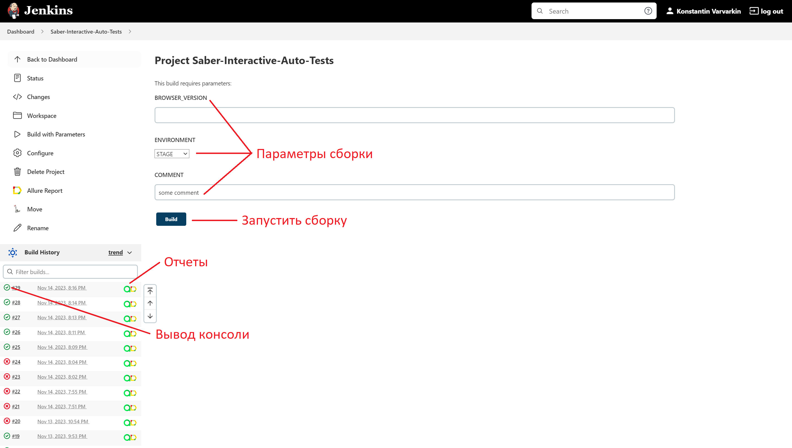

# Проект по тестированию сайта "Saber Interactive"
> <a target="_blank" href="https://cyber.games/">Saber Interactive</a>


### Список проверок, реализованных в автотестах

- [x] Раздел 'About' отображается
- [x] Перейти к игровому проекту возможно
- [x] Перейти к студии возможно
- [x] Перейти к новости возможно
- [x] Перейти в раздел 'Careers' возможно
- [x] Отправить контакты возможно

[//]: # (### Тест-кейсы)

[//]: # ()
[//]: # (![main page screenshot]&#40;/qa_guru_python_8_15/pictures/test-case-mind-map.png&#41;)

### Используемый стэк

<p align="left">


</p>

### Локальный запуск автотестов

#### Выполнить в cli:
```bash
python -m venv .venv
source .venv/bin/activate
pip install -r requirements.txt
pytest -s -v . --browser-version=100
```

#### Получение отчёта:
```bash
allure serve build/allure-results
```

### Запуск автотестов в Jenkins

#### 1. Открыть <a target="_blank" href="https://jenkins.autotests.cloud/job/Saber-Interactive-Auto-Tests/">проект</a>



#### 2. Нажать "Build with Parameters"
#### 3. В поле "BROWSER_VERSION" ввести: 100
#### 4. Из списка "ENVIRONMENT" выбрать: PROD
#### 5. В поле "COMMENT" ввести комментарий
#### 6. Нажать "Build"

